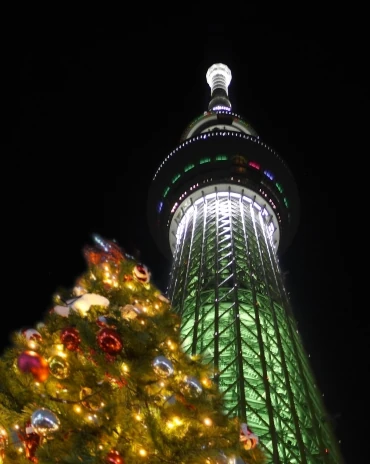

# sky tree nest xmas🗼
スカイツリーのエレベーターで上に登ったことはあるかい？ドキドキするよね。もう一回、あのドキドキを体験したくて、こんなものを作ってみたんだけど、どうかな？

### Solution
パスワードで保護された7zipファイルとパスワードが書かれたテキストファイルが渡される

試しに、渡されたテキストファイルをもとに解凍すると次の7zipファイルとテキストファイルが渡される

なので、ネストしてあるzipファイルを続々と解凍するために以下を書いた

```python
import py7zr

password = ""
with open("pass.txt") as f:
    password = f.read().replace('\n','')
with py7zr.SevenZipFile(f'skytree.7z', mode='r', password=password) as z:
    z.extractall()

for i in range(1000):
    with open(f"pass{i+2}.txt") as f:
        p = f.read().replace('\n','')
        # パスワードはそれ以前までのパスワードと今のパスワードを連結するだけ
        password += p
        print(password)
    with py7zr.SevenZipFile(f'skytree{i+2}.7z', mode='r', password=password) as z:
        z.extractall()
```

実行すると、`skytree634.7z`まで解凍され、中に以下のような画像がある



これをバイナリエディタで開くと下の方にflagがある

`imctf{xmas_colored_skytree_is_bright}`